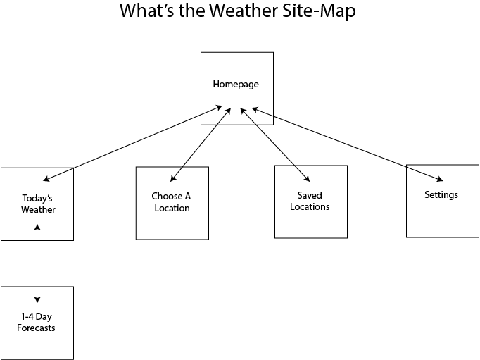

# What's the Weather

## Overview

Mornings are hard enough without having to think about the weather. Hopefully, *What's the Weather* will help!

*What's the Weather* is designed to be an interactive homepage for its users. At its core, it's a web app that locates where the user is and provides a variety of information. It'll display the current time & weather and allow the user to look up the forecast for the next few days. Users will be able to personalize their view (as well as everyone else's!) of the web app through submitting GIFs. They will also be able to find the weather + forecast for different locations as well as saving certain locations. The saved locations will be displayed on a separate page- along with the current time and forecast.

## Data Model

We'll need to store a few things:
* the saved locations
* the recently viewed locations
* short animated videos/gifs for the background

Schemas:

```javascript
// users saved locations
var SavedLocation = new mongoose.Schema({
  name: String,
  lat: Number,
  long: Number,
  forecast: String,
  temp: Number
});
mongoose.model('SavedLocation', SavedLocation);

// background gifs
var Background = new mongoose.Schema({
  name: {type:String, enum:['sunny', 'cloudy', 'rainy', 'snowy', 'thunder']},
  timeOfDay: {type:String, enum:['morning', 'night']},
  url: {type: String, required: true}
});
mongoose.model('Background', Background);

//past viewed locations
var PastViewed = new mongoose.Schema({
  name: String
});
mongoose.model('PastViewed', PastViewed);
```

## Wireframes

Homepage

[See the live version](http://i6.cims.nyu.edu/~jmw633/480/AIT/wireframe/)


## Screen Capture of Geolocation + Forecast Functionality
Full .mov file in documentation/ait-original-capture.mov (cannot be displayed because size is too large- sorry!)

## Site Map



## User Stories

* As a user, I want to find out the weather based on my location.
* As a user, I want to be able to find the weather based on any location of my choosing.
* As a user, I want to save certain locations and be able to compare them side by side.
* As a user, I want to see the 4 day forecast based either on my location.
* As a user, I want to personalize my experience.
* As a user, I want the experience of using the app to be effortless and enjoyable so that I will repeatedly use the app.

## Research Topics

* (2 points) Implement [Google Maps JavaScript API](https://developers.google.com/maps/documentation/javascript/)
    * The Google Maps JavaScript API allows developers to work with Google maps (and all of their corresponding functionalities- directions, saving directions, etc.), geolocation and adding street views/imagery.
    * I plan to use this API for several purposes:
      * Allow the user to scroll/interact with a map and ultimately, select a location.
      * Utilize geolocation to automatically grab the user's location
    * Examples [here](https://developers.google.com/maps/documentation/javascript/examples/map-geolocation) and [here](https://developers.google.com/maps/documentation/javascript/examples/map-simple)
* (2 points) Implement [Open Weather Maps API](http://openweathermap.org/)
  * Open Weather Maps API allows for developers to get the weather data given a city name, a set or coordinates or a city's ID. It provides the temperature (current, max and min), forecast, humidity levels, sea level, wind speeds for the next 5 days (with intervals of 3 hours).
  * I'll use this API to grab the current weather of the user's location as well as the weather of any location that the user requests. I'll also grab the 5 day forecasts when requested.
  * Examples [here](http://openweathermap.org/api) and [here](http://openweathermap.org/forecast5)
* (1 point) Implement [AniJS](http://anijs.github.io/)
    * AniJS is a Javascript library that integrates simple animations to make user experience better.
    * I'll use this to make using the app more fluid and enjoyable.
    * Examples [here](http://codepen.io/darielnoel/full/ypfEs/) and [here](http://codepen.io/darielnoel/full/uJLGb/)
* (1 point) [Bootstrap](http://getbootstrap.com/)
    * Use Bootstrap for CSS framework
    * Minimally, use Bootstrap for consistent headers and table formatting across the entire app.
