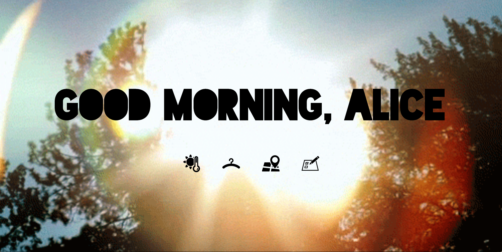
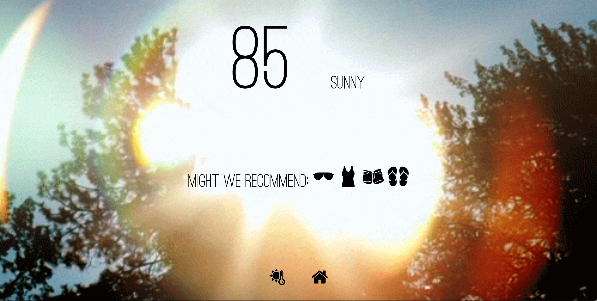
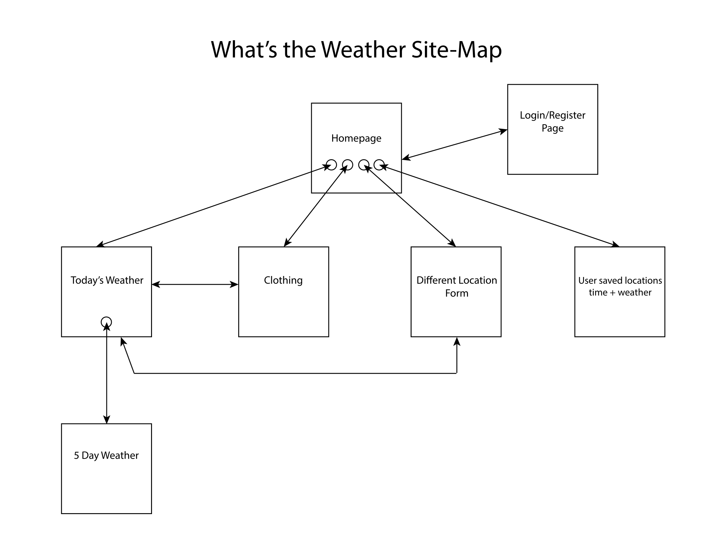

# What's the Weather

## Overview

Mornings are hard enough without having to check the weather and spend precious brain cells thinking about what to wear. Hopefully, *What's the Weather* will help!

*What's the Weather* is a web app that locates where the user is and provides a variety of information. It'll display the current time and weather, the forecast for the day and suggest certain items of clothing to make the user's morning routine quick and easy. Users will be able to register and login, personalizing their view of the web app. They will also be able to find the weather + forecast for different locations as well as saving certain locations as favorites. The favorite locations will be displayed on a seperate page- along with the current time and forecast.

## Data Model

We'll need to store a few things - they can be divided by whether they relate to the user or not:
* Relating to the user:
    * a list of users
    * the user's saved locations
* Not relating to users (avaliable to users who don't register):
    * short animated videos/gifs for the background
    * clothing icons
    * weather information grabbed from gmaps

First draft schema:

```javascript
// users
// users can have several saved locations associated with their account
var User = new mongoose.Schema({
    locations:  [{type: mongoose.Schema.Types.ObjectId, ref: 'SavedLocation' }]
});

// users saved locations
var SavedLocation = new mongoose.Schema({
    name: String,
    lat: Number,
    long: Number
});

// background gifs
var Background = new mongoose.Schema({
    name: {type:String, enum:['sunny', 'cloudy', 'rainy', 'snowy', 'thunder']},
    timeOfDay: {type:String, enum:['morning', 'night']},
    url: {type: String, required: true}
});

// clothing icons
var ClothingIcons = new mongoose.Schema({
    name: String,
    url: {type: String, required: true}
});

// weather info
var Weather = new mongoose.Schema({
    forecast: {type:String, enum:['sunny', 'cloudy', 'rainy', 'snowy', 'thunder']},
    high: Number,
    low: Number,
    sunrise: Number,
    sunset: Number,
    current: Number
});

```

## Wireframes

Homepage

[See the live version](http://i6.cims.nyu.edu/~jmw633/480/AIT/wireframe/)

Clothing

[See the live version](http://i6.cims.nyu.edu/~jmw633/480/AIT/wireframe/clothing.html)


## Site Map



## User Stories

* As a user, I want to find out the weather based on my location.
* As a user, I want to be able to find the weather based on any location of my choosing.
* As a user, I want suggestions on what clothing is appropriate based on the weather.
* As a user, I want to save certain locations and be able to compare them side by side.
* As a user, I want to see the 5 day forecast based either on my location or a chosen location. 
* As a user, I want to personalize my experience. 
* As a user, I want the experience of using the app to be effortless and enjoyable so that I will repeatedly use the app.

## Research Topics

* (3 points) Integrate User Authentication
    * I'll use passport for user authentication.
    * Users will be able to save a list of locations and view each location's current time and weather on a special view.
    * Ideally, users will also be able to personalize and format their view of the app. 
* (1 point) Implement [gmaps.js](https://hpneo.github.io/gmaps/)
    * gmaps is just a simplified verison of the Google Maps API. It allows for using markers/geolocation/calculating latitude and longitude.
    * I'll use gmaps to allow the user to find the weather of different locations - they can either pick the location by adding a marker on a interactive map, filling in the latitude/longitude, or the city name.
    * Examples [here](https://hpneo.github.io/gmaps/examples.html)
    * Potentially- if gmaps does not serve all my needs, I may sub this out for the Google Maps API.
* (1 point) Implement [AniJS](http://anijs.github.io/)
    * AniJS is a Javascript library that integrates simple animations to make user experience better.
    * I'll use this to make using the app more fluid and enjoyable.
    * Examples [here](http://codepen.io/darielnoel/full/ypfEs/) and [here](http://codepen.io/darielnoel/full/uJLGb/)
* (1 point) [Bootstrap](http://getbootstrap.com/) 
    * Use Bootstrap for CSS framework
    * Minimally, use Bootstrap for consistent headers and table formatting across the entire app.
